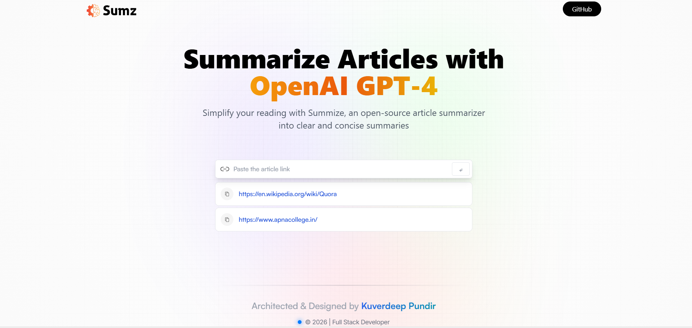

# 🤖 AI-ArticleSummarizer

<div align="center">
  
  
  
  
</div>

---

### 🌐 [Live Demo Link](https://kuverdeep-aisummarizer.netlify.app/)

**AI-ArticleSummarizer** is a high-performance web application that leverages **OpenAI GPT-4** to transform dense articles into clear and concise summaries. Designed for efficiency, it allows users to skip the fluff and get straight to the facts.

## 🖼️ Preview

<div align="center">

  

</div>


---

## 🚀 Key Features

* **AI-Powered Summarization**: Uses GPT-4 via RapidAPI to extract the core essence of any article.
* **Persistent History**: Integrated **Local Storage** to keep track of your recently summarized articles.
* **Modern UX**: Built with a "Mobile-First" approach using **Tailwind CSS**.
* **Secure Authorization**: Implements environment-based API key management to ensure secure requests to the RapidAPI gateway.
* **Copy-to-Clipboard**: Quick copy functionality for both article links and generated summaries.

## 💻 Tech Stack & Knowledge Used

* **Frontend Library**: React (Vite)
* **Security**: API Key Authorization & Environment Variables
* **Styling**: Tailwind CSS (PostCSS)
* **API Integration**: RapidAPI (Article Extractor and Summarizer)
* **Deployment**: Netlify (Continuous Deployment via GitHub)

## 🛡️ Authorization & Security

To protect sensitive information, this project uses:
* **Environment Variables**: API keys are never hard-coded in the source files and are managed via `.env`.
* **Header Authorization**: Requests are authorized using custom headers (`X-RapidAPI-Key` and `X-RapidAPI-Host`) to ensure only verified requests are processed.

## 🛠️ Installation

1. **Clone the repo:**
   ```bash
   git clone (https://github.com/ishurana001/AI-ArticleSummarizer.git)
   ```
2. **Install dependencies:**
   ```bash
   npm install
   ```
3. **Add your OpenAI API key:**
   ```bash
   Create a .env file in the root and add:
   ```
4. **Run locally:**
   ```bash
   npm run dev
   ```
